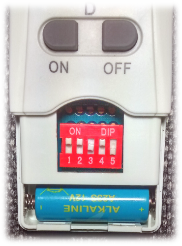

Wireless Socket Sniffer/Remote Control
============================================

Sniff packets of the remote with your SDR and see what socket has been turned
on/off. Also, you can control the wireless sockets.


The System
----------

This is what a socket and the remote look like.
[](pics/socket-and-remote.png)


You can configure the address (aka. system-code) and the identifier (aka.
unit-code) of your sockets using the DIP switches.
[](pics/dip-switches-socket.png)

Don't forget to set the same address on the remote.
[](pics/dip-switches-remote.png)

For controlling the sockets, the remote sends out a simple signal modulated using
on-off-keying (ASK/OOK). The encoding is covered by this great
[blog post](http://hartgeloetet.blogspot.de/2014/05/hacking-intertec-funksteckdosen.html)
(German, but with helpful pictures).


Requirements
------------

* A working installation of GnuRadio.
  This project was created with GNU Radio Companion 3.7.9 git-99-gaae64454.
  GNU Radio Companion 3.7.8 worked well too.
* A Software Defined Radio (e.g. HackRF, rad1o, USRP, RTL-SDR, etc.)
  This project was tested with the [rad1o](https://rad1o.badge.events.ccc.de/)
  SDR.
* An antenna suitable for the 433 ISM band.


Configure the Software
----------------------

Although the socket is labeled "433.92 MHz" I got the best results when
setting the channel frequency to 433.85 MHz. You can set the
channel frequency by editing the `channel_freq` variable in the GnuRadio
flow graph (.grc files). Also you can switch the SDR source/sink (e.g. to UHD)
and edit its gain values.

Don't forget to delete the `wireless_socket_rx_gr.py`/
`wireless_socket_tx_gr.py`. A new version of these files will be generated
which will include the changes made in the GnuRadio flow graph.


Sniffing Packets
----------------

You can sniff the commands of remote controls to see what socket with what
address has been switched on/off.

```
$ cd rx
$ ./wireless_socket_rx.py -h
usage: wireless_socket_rx.py [-h] [-g] [-l] [-e]

optional arguments:
  -h, --help           show this help message and exit
  -g, --grcoutput      Show the output of gnuradio/grcc.
  -l, --ignore-length  Show packets even if the length is not 25 bits.
  -e, --ignore-errors  Decode packets even if some bits make no sense.
```

Example:
```
$ cd rx
$ ./wireless_socket_rx.py
[+] Create UDP server to receive gnuradio output.
[+] Launch gnuradio script to feed the UDP server.
[+] Wait 1 second for gnuradio to boot up.
[+] Start decoding.
[+] New Packet:
  Address: 01101
  Identifier: B
  State: ON
^C
[+] Got keyboard interrupt.
[+] Terminate gnuradio.
[+] Close UDP server.
[+] Exit.

```


Controlling Sockets
-------------------

You can control the socket using the `wireless_socket_tx.py` script.
Just specify the address, socket identifier and the state you want to put
it into (on or off). Also, there is some kind of a brute force feature.
Switch on/off all sockets within range of your SDR by a simple command.
But remember: This will probably switch off the sockets of you neighbors too.
And you don't what to switch off their aquarium infrastructure to let the
poor fishes die, won't you?

```
$ cd tx
$ ./wireless_socket_tx.py -h
usage: wireless_socket_tx.py [-h] [-g] [-r REPEAT] -a ADDRESS -i IDENTIFIER -s
                             STATE

optional arguments:
  -h, --help            show this help message and exit
  -g, --grcoutput       Show the output of gnuradio/grcc.
  -r REPEAT, --repeat REPEAT
                        Repeat every packet REPEAT times. Default is 3.
  -a ADDRESS, --address ADDRESS
                        Address string of sockets, e.g. 00101 or ALL.
  -i IDENTIFIER, --identifier IDENTIFIER
                        Socket identifier. A, B, C, D, E or ALL.
  -s STATE, --state STATE
                        Switch the power 'on' or 'off'.
```

Example (switch on socket B with address 01101):
```
$ cd tx
$ ./wireless_socket_tx.py -a 01101 -i b -s on
[+] Create FIFO file to communicate with gnuradio.
[+] Launch gnuradio script to send packages from the FIFO file.
[-] gnuradio script not found. Creating script from .grc file.
[+] Wait 1 second for gnuradio to boot up.
[+] Every packet will be repeated 3 times.
[+] Added packet to send queue: addr=01101, id=b, state=on.
[+] Sending packets... This will take about 0.149 seconds.
[+] Wait 1 second before terminating gnuradio.
[+] Terminate gnuradio.
[+] Remove FIFO file.
[+] Exit.
```

